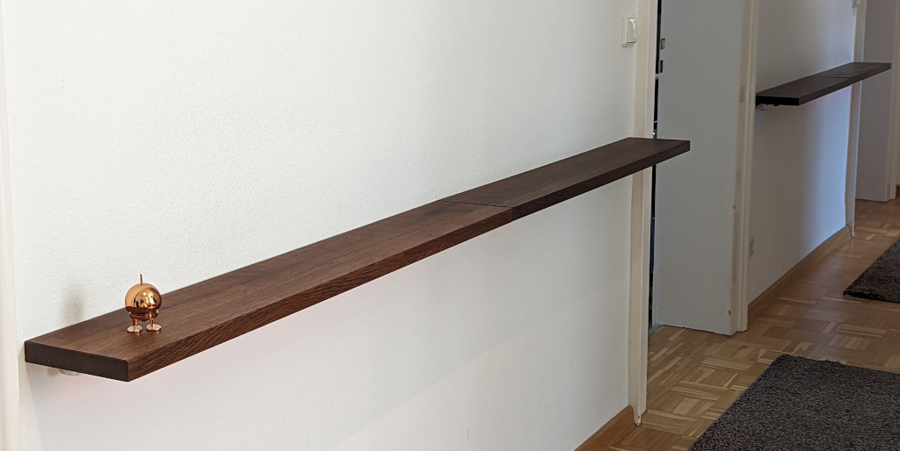

# Hardware construction

## Some pictures of the final installation

The two shelfs in the hallway anf the interrupting door

A view from the underside. You can see the LED stripe and one sensor clearly. Note that the sensor is in fact not exactly positioned according to the config file (it should be exactly located at the outer edge of the stripe. This is for historic reasons and will at one point in time changed to move closer to the edge).

Closeup of a sensor attached to the wooden square rod that holds also the LED stripe

## Raspberry Pi

I am using in my installion a Raspberry Pi 3b. This has plenty enough
of horsepower to drive the project. In idle mode (no lights
burning/effect running, only the readout loop of the sensors) the CPU
usage is around 1.7%

**TODO**

- more images of the housing of the Pi and the custom board.
- electrical schematics

