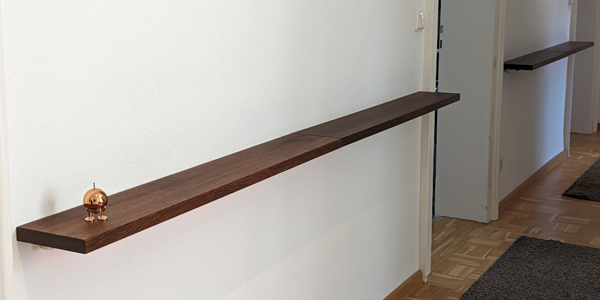
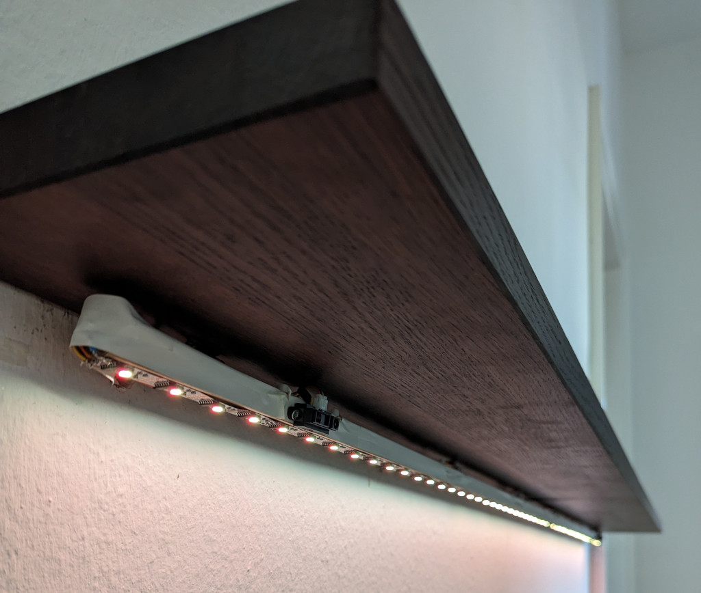
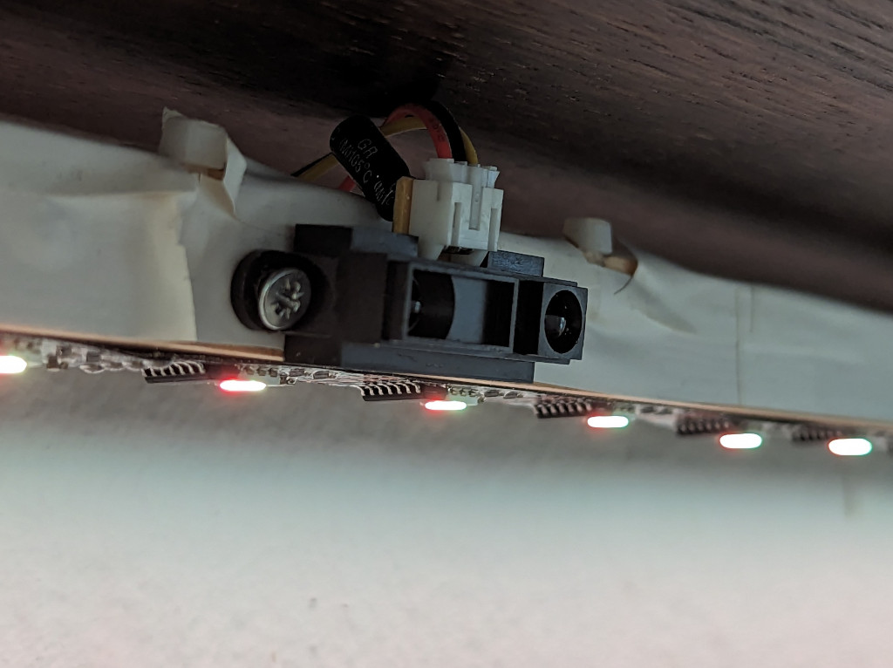

# Hardware construction

## Some pictures of the final installation

The two shelves in the hallway and the interrupting door

A view from the underside. You can see the LED stripe and one sensor
clearly. Note that the sensor is in fact not exactly positioned as
described in the config file (it should be located exactly at the
outer edge of the stripe. This bug is there for historic reasons and
will at one point in time changed by moving the sensor closer to the
edge).

Closeup of a sensor attached to a wooden square rod (covered in white
tape) that holds also the LED stripe

## Raspberry Pi

I am using in my installion a Raspberry Pi 3b. This has plenty enough
of horsepower to drive the project. In idle mode (no lights
burning/effect running, only the readout loop of the sensors) the CPU
usage is around 1.7%

**TODO**

- more images of the housing of the Pi and the custom board.
- electrical schematics

