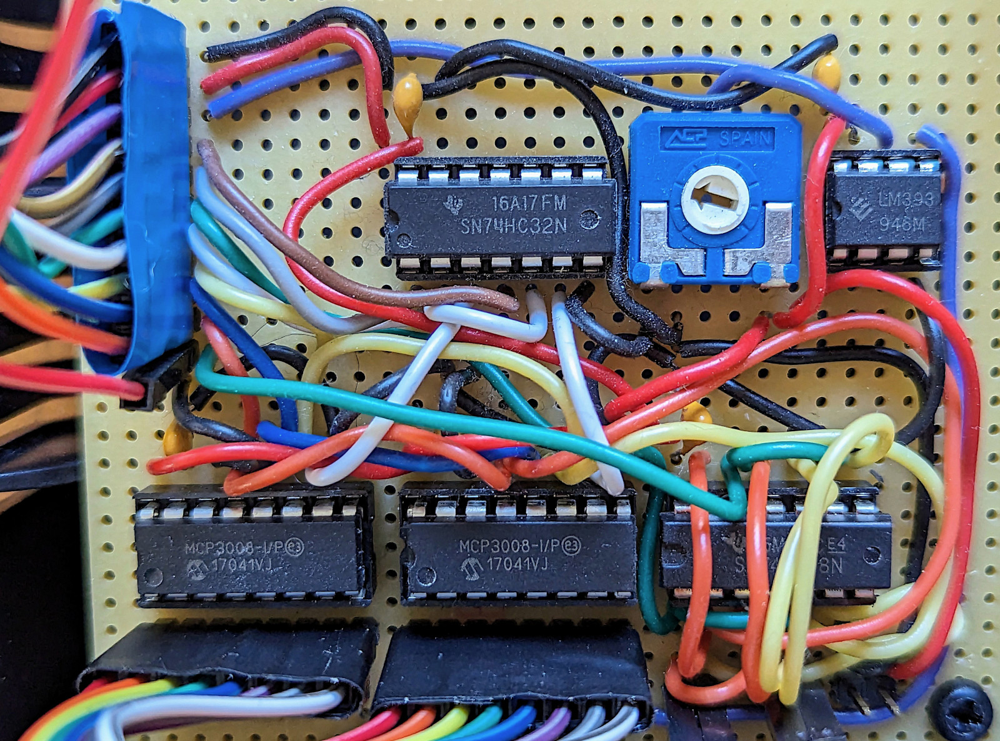

# Hardware construction

## Some pictures of the final installation

The two shelves in the hallway and the interrupting door

A view from the underside. You can see the LED stripe and one sensor
clearly. Note that the sensor is in fact not exactly positioned as
described in the config file (it should be located exactly at the
outer edge of the stripe. This bug is there for historic reasons and
will at one point in time changed by moving the sensor closer to the
edge).

Closeup of a sensor attached to a wooden square rod (covered in white
tape) that holds also the LED stripe

The uninteresting looking box containing the Pi, the logic board and a
off the shelf power supply to drive everything, including the attached
LED stripes and the sensors.

The uninteresting looking box from the other side. I am using a
centronics style connector to attach everything: Power for the LED
stripes & sensors, SPI lines for the stripes and 16 signal lines for
the sensors (The SPI goes to the ADCs which are in the case, not to
the outside sensors)

## Raspberry Pi

I am using a Raspberry Pi 3b in my installation. This has plenty enough
horsepower to drive the project. In idle mode (no lights
burning/effect running, only the readout loop of the sensors is
active) the CPU usage is around 1.7%. While the multiblob effect is
running as configured in the default config file CPU usage goes up to
around 4.3%.

The OS used is standard Rasbian, and - thanks to the fact that GO
compiles to a static binary - there is not much else needed more than
that. You have to enable the SPI interface on the Pi though, there is
plenty of documentation on the net on other things you could do (like
overclocking, which may be overkill. One thing I did was making sure
that the CPU doesn't scale but instead keeps running at a steady
frequency as it seems to help with getting the SPI timings right, but
YMMV)

## The more interesting inside of the box

**BIG WARNING if you don't feel competent to work with mains voltage - DON'T DO IT**

**FOLLOWING WHAT I DID OR TRYING YOURSELF YOU ARE DOING AT YOUR OWN RISK**

**While I may (or may not) have a little clue about current and
voltage myself, I am in no means in the position to give anybody
reliable help on what or what not to do when it comes to dangerous
voltage and amp levels**

The next picture shows the opened box. The big thing closest to the
camera is the off the shelf power supply. It's 5V and enough amps to
drive the LED segments attached safely (and yes, also the Pi
itself and the sensors need their share of power).

Behind on the right is the Raspberry Pi 3b v1.2 used, and left next to
it is the custom multiplexer logic board.

The next image show the connectors that are attached to the Pi (as far
as it can be seen there. The one and lonely connection at the left has
been added later when I realized I had to drive 2 LED stripes and
needed to hack another device into the multiplexer) 

This connection routes the SPI GPIO pins and the GPIO pins used for
multiplexing the SPI port on the custom logic board (see below for
more info) 

### The custom logic board

This is a bloody rat's nest of wires here...

The block labeled "Ignore" is from an old experiment to detect the
input of __any_ sensor. The potentiometer and the small OpAmp where
used as a trigger to set another GPIO pin high and - detecting this
interrupt - the software would only then start to loop the sensors for
data (and stop again after some time of inactivity). The idea was to
put less stress on the Pi in the mostly idle time. After rewriting the
whole thing in GO (coming from phyton...), CPU utilisation is so low
anyway that I no longer implemented that.

The next picture shows the simplified schematic (things like Vcc, GND
or e.g. the capacitors at the power inputs of the chips silently
ignored...)

I assume this is for sure not the most elegant way to do the
multiplexing. E.g. I see no good reason why I didn't do the `CS`
select on the two ADCs directly via a GPIO pin (instead of via two
`OR` gates) that can be set to `LOW` and ignore the `CS` pin from the
Pi completely (remember, `CS` needs to be pulled `LOW` to active the
SPI device). I assume this is for historical reasons - the whole board
is the result of me actually creating my first digital circuit some
years ago.

Anyway - it seems to work. `CLK` is shared among all devices, `MISO`
between both ADCs. MOSI is connected to both ADCs, but gated through
the two `AND` gates to the LED segments connection, so only one of
them get's the input signal at a time (the ADCs will ignore it if `CS`
is high).

