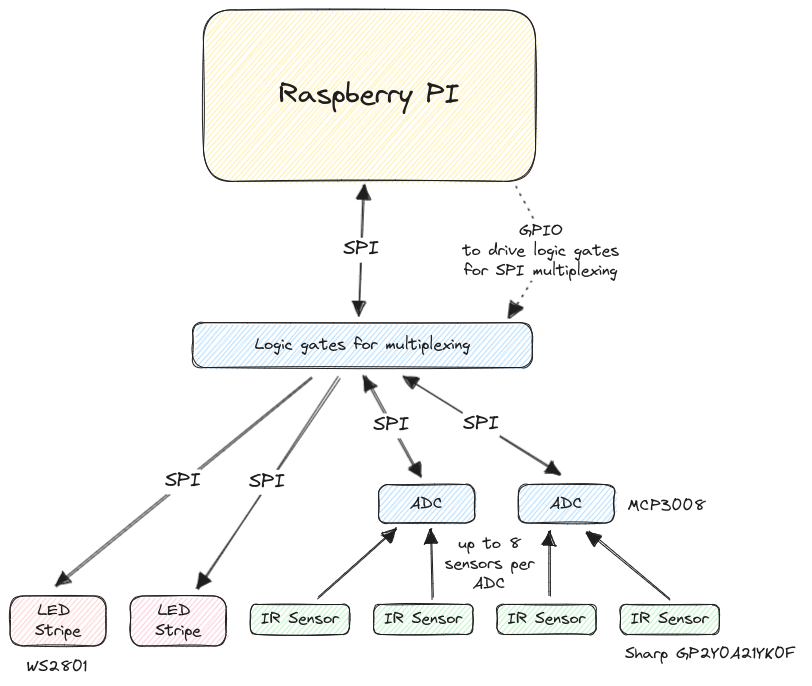

# Go-LEDS

This Project implements a multi-part LED stripe (ws2801) that is
controlled by 4 infrared sensors attached to analog-digital converters
(MCP3008) to catch people passing by with the net effect of
illuminating my hallway.  All sensors and LED stripes are connected to
a Raspberry Pi via SPI via a small board of logic chips to enable SPI
multiplexing.

A couple of "producers" are supplied (see the directoy named
accordingly) - these control various ways to illuminate the
stripes. The most important one is the sensorledproducer - each sensor
is linked to one instance of those. It reacts to a sensor trigger by
illuminating the stripe LED by LED starting from the position of the
sensor to both ends of the stripe. After a while, the effect is
reversed and the lighted area shrinks LED by LED until it vanishes at
the point where the sensor is located.

Other producers are explained in more detail below (**TODO**)

All hardware related stuff is held in the hardware package but mostly
configurable via the config file - you can easily change
it to match your hardware (number and lenght of stripes, sensors, placement of
sensors, GPIO pins used for multiplexing etc.)

The specific layout used in my apartment is shown below:

| Stripe 1        | Door                |        Stripe 2 |
|:----------------|:-------------------:|----------------:|
| 0-69            | (invisible segment) |          70-124 |
| Sensor S0 left  |                     |  Sensor S2 left |
| Sensor S1 right |                     | Sensor S3 right |

This can be easily changed in the config file _config.yml_. 4 devices are used via
SPI (2 led stripes, and 2 MCP3008 as ADC - these 2 ADCs allow for up
to 16 sensors to be attached, although only 4 are used in my setup)

