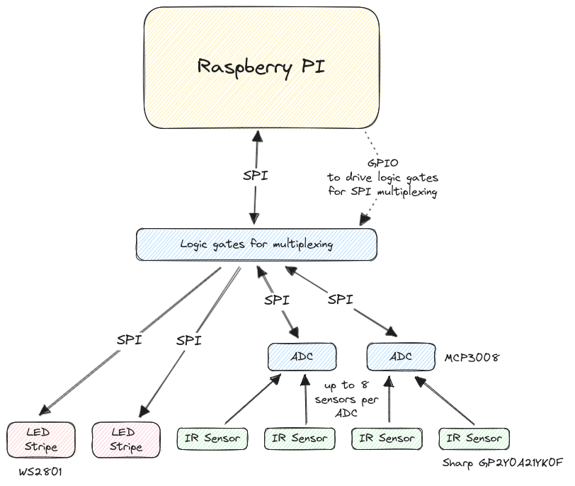
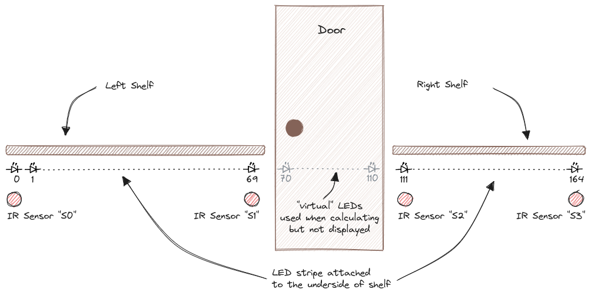
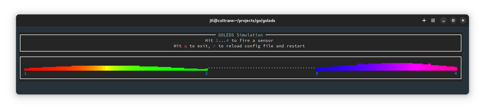
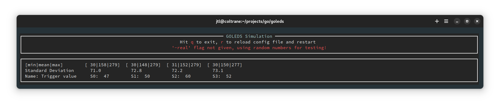

# Go-LEDS

This project implements a multi-part LED stripe (WS2801) that is
controlled by multiple infrared sensors (Sharp GP2Y0A21YK0F or
similar) attached to analog-digital converters (MCP3008) to turn on
the LED stripes whenever someone is passing by. Sensors and LED
stripes are connected to a Raspberry Pi via SPI and a small board of
logic chips (AND and OR gates) to enable SPI multiplexing, selectable
via GPIO pins.

## Example setup 

The specific layout used in my hallway is shown below:

| Stripe 1                   | Door                                     |                    Stripe 2 |
|:---------------------------|:----------------------------------------:|----------------------------:|
| LED 0-69                   | "virtual LED" 70-110 (invisible segment) |                 LED 111-164 |
| Sensor S0 left (index 0)   |                                          |  Sensor S2 left (index 111) |
| Sensor S1 right (index 69) |                                          | Sensor S3 right (index 164) |

4 devices are connected via SPI (two WS2801 LED stripes, and two
MCP3008 as analog-digital converters (ADC) - these 2 ADCs allow for up
to 16 sensors to be attached, although only 4 are used in my
setup). The reason 2 ADCs are used for 4 sensors is a left-over from
an earlier prototype where 14 sensors were used spread out over the
length of the two LED stripes. This turned out to be problematic
because of heavy cross talk between the sensors, so reducing them to
be placed only at the possible entry points for people passing by
proofed to be enough.

Other setups may have a need for more sensors, so the hardware can
easily accomodate for 12 more input channels.

All hardware related stuff is held in the hardware package (GPIO
library and the SPI code to drive MCP3008 and WS2801). If you want to
change to a different ADC or LED stripe that behaves differently via
SPI you should be able to make changes only to `hardware/hardware.go`
Much aspects of the hardware setup is configurable via the config file
`config.yml` - you can easily change it to match your hardware (number
and lenght of stripes, sensors, placement of sensors, GPIO pins used
for multiplexing etc.)

More drastic changes may require changes at the hardware level
(attaching more than 4 devices e.g. more LED stripes) by changing the
multiplexing circuit.

### Building the hardware

The hardware used to implement the setup described above is detailed
[here](Hardware.md)

## Mode of operation 

A couple of _producers_ are supplied with the software (see the
directory named accordingly) - these control different ways to
illuminate the stripes. As far as the producers are concerned, there
is only one continuous stripe, regardless of how many LED segments are
configured for the system. In the example above, the producers see a
LED stripe of 165 LEDs (index 0 - 164) that can be illuminated and
colored independently (but only does mapped to a LED segment will be
visible).

The most important producer is the `sensorledproducer` - each sensor
is linked to one instance of those. It reacts to a sensor trigger by
illuminating the stripe LED by LED starting from the position of the
sensor to both ends of the stripe. After a while, the effect is
reversed and the lighted area shrinks LED by LED until it vanishes at
the point where the sensor is located.  Other producers are explained
in more detail in the configuration file (link below).

All producers hold their independent internal representation of the
full stripe. For displaying on the real LEDs, all data of all
producers is combined and the result is displayed on the various LED
stripe segments (or simply not displayed in the case of an invisible
segment). That also means that multiple producers can be active (and
often are) at the same time.

The combination of the different dedicated LED values from all
producers is very naive - for each LED, take the max of all the
producers data for that LED, but component wise for red, green and
blue. E.g, if you combine a LED value of red,green,blue `[10,20,30]` with
`[10,10,40]` and `[15,5,5]` the result will be `[15,20,40]`. 

With this information we can understand what happens when a person is
entering the area of the LED stripes e.g. from left and passes in
normal walking speed fully to the right:

1. passing `S0`, the stripe is illuminated starting at LED index `0`,
   quickly growing to fully light all LEDs up to the rightmost one at
   index `164`
   
2. passing `S1`, the associated producer lights the LED at position
   `69`, and the effect grows in both directions to cover all
   LEDs. But because of the delay between `S0` and `S1` triggering,
   and because of both producers using exactly the same definition for
   their ON state, this is not visible (`S0` has always already
   switched on the LEDs before they are illuminated by `S1`)
   
3. similar for `S2`

4. Again similar for `S3`. In the meantime the `S0` producer (or maybe
   even `S1`, `S2`) may have already started or finished to shrink
   back to the index of their origin. Again this is not visible
   because `S3` is the last one still illuminating the full
   stripe. After a configurable time, `S3` starts to shrink again the
   illuminated part of the stripe with the effect that the LEDs start
   to go off one by one starting at index `0` until all LEDs are off
   again.
   
### Full configuration

The system is configured via a config file (default is `config.yml`
but this can be overwritten on the command line with the switch
`-config`)

**See the example configuration [here](config.yml). Please look into
this file for a description of all the config parameters, including a
description of all the different producers that are available**

Some more important aspects that need explanation that go beyond what
can be learned from the configuration file and its comments:

There is a currently hard coded dependency between the different
producers: 
  * At the end of a trigger cycle of (maybe multiple)
  sensorledproducers (in other words: when the lights have gone off
  again) both multiblobproducer and cylonproducer are triggered to
  start (if they are enabled in the first place). They then run either
  their configured time or are being stopped again when another
  sensorledproducer cycle is being started.
  * If the multiblobproducer is started, it stops for the time of its
    activity a possibly running nightlightproducer.
  * This is not implemented for the cylonproducer.
    
This is done so the different colors and LEDs of the producers don't
mix with each other where we don't want that.

### How to start the program on the Raspberry Pi

The SPI library used really wants to have full priority for getting
its timing right. My best experience comes from having it run in real
time mode like this (Linux, don't know how the equivalent works on
other OSs):

`chrt 99 /path/to/goleds/goleds_pi -real`

The program is called `goleds_pi` here as it is cross compiled via
`build.sh` for ARM on my development machine.

The command line switch `-real` is needed to tell the program to
really try to interact with the GPIO and SPI on the Pi (see next
section on what happens if you don't use the `-real` switch)

### Text based UI for simulating

Go-LEDS comes with a little text user interface simulation program to
aid during the development (E.g. of new producers). Brightness is
represented here by different sizes of unicode block symbols for
each LED. Color reproduction is not really faithful to reality, but
enough to be able to develop if away from the real hardware.

Go-LEDS starts automatically in TUI simulation mode whenever called
without the `-real` command line parameter.

There is another use case for the TUI. When configuring the
installation, one of the things that requires quite some tweaking is
to get the TriggerValues for the sensors right: high enough, that
no noise from cross talk or background IR is triggering the LEDs, but
low enough that the system is sensitive enough to reliably detect all
people passing by. This highly depends on the Room and length and
object distance that needs to be dealt with.

For this, the switch `-show-sensors` together with `-real` opens up
the TUI and displays (for a sliding window of 500 measurements) the
minimum, mean and maximum value being recorded plus the standard
deviation. The goal is to have it running first without having someone
passing by (in other words: do a try run of the system to measure the
noise floor) and to try to orient the sensors in a way that the standard
deviation is small (no max values that are much bigger than the
mean... min values shouldn't be your problem here).

This setup of the sensors may include restricting the path of sight
where light falls onto the sensor to shield it from noise sources
(like all the other sensors in the system) or playing with the place
and orientation of the sensor fixture.

The following picture shows the TUI in sensor mode (Note that you can
also omit the `-real` switch -- in this case the system will just use random
data. This is only useful while developing the TUI itself)

