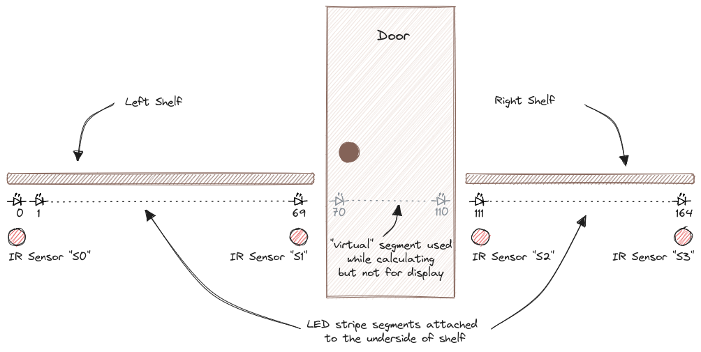

# Go-LEDS

Go-LEDS is a flexible lighting system designed to control LED strips
using infrared (IR) sensors. It's built to run on a Raspberry Pi, but
includes a terminal-based simulation for development and testing
without hardware. The system activates custom light animations when a
person passes by a sensor, creating interactive and dynamic lighting
effects.

https://github.com/jtl5770/goleds/assets/24967370/34057911-faef-4403-bd07-7b479bec8213

<!--toc:start-->
- [Go-LEDS](#go-leds)
  - [Key Features](#key-features)
  - [How It Works](#how-it-works)
    - [Platform Abstraction](#platform-abstraction)
    - [Producers: The Animation Engine](#producers-the-animation-engine)
    - [Example Hallway Setup](#example-hallway-setup)
  - [Getting Started](#getting-started)
    - [1. Building the Hardware](#1-building-the-hardware)
    - [2. Configuration](#2-configuration)
    - [3. Running the Application](#3-running-the-application)
      - [On Raspberry Pi (Real Hardware)](#on-raspberry-pi-real-hardware)
      - [In TUI Simulation Mode](#in-tui-simulation-mode)
    - [4. Calibrating Sensors](#4-calibrating-sensors)
  - [Available Producers](#available-producers)
  - [Future Ideas](#future-ideas)
<!--toc:end-->

## Key Features

*   **Sensor-Triggered Animations**: Activates lighting effects based
    on IR sensor input.
*   **Modular Animation "Producers"**: Easily create and combine
    different light patterns (e.g., pulses, moving blobs, cylon eyes).
*   **Hardware Abstraction**: Runs on both real Raspberry Pi hardware
    and in a terminal-based UI (TUI) for simulation.
*   **Highly Configurable**: Define LED layouts, sensor placements,
    GPIO pins, and producer behaviors in a single `config.yml` file.
*   **Dynamic Reloading**: Reloads configuration on-the-fly by sending
    a `SIGHUP` signal, without a full restart.
*   **TUI for Development**: Includes a text-based interface for
    simulating LED behavior and calibrating sensor trigger levels.

## How It Works

### Platform Abstraction

Go-LEDS decouples the core logic from the hardware through a
`platform.Platform` interface. This allows the application to run
seamlessly in different environments. Two platforms are provided:

*   **`platform.RaspberryPiPlatform`**: Interacts with real hardware
    on a Raspberry Pi, managing GPIO and SPI communication with LED
    strips (e.g., WS2801, APA102) and ADC converters (e.g., MCP3008).
*   **`platform.TUIPlatform`**: A terminal-based simulation for
    development and testing. It visualizes the LEDs and allows sensor
    triggers via key presses, removing the need for physical hardware.

### Producers: The Animation Engine

All light animations are generated by **Producers**. Each producer
manages its own state for a single, continuous virtual LED strip. The
application then combines the outputs of all active producers and maps
the result onto the physical (or simulated) LED segments defined in
the configuration.

This combination is done by taking the maximum value for each color
component (Red, Green, Blue) for every individual LED. For example, if
three producers output `[10,20,30]`, `[10,10,40]`, and `[15,5,5]` for
the same LED, the final displayed color will be `[15,20,40]`.

This powerful layering allows for complex and interacting visual effects.

### Example Hallway Setup

The original setup for this project was a hallway with a door in the
middle, splitting the LED strip into two physical segments.

| Strip 1              | Door                 |               Strip 2 |
|:---------------------|:--------------------:|----------------------:|
| LED 0-69             | "virtual" LED 70-110 |           LED 111-164 |
| Sensor S0 (index 0)  |                      | Sensor S2 (index 111) |
| Sensor S1 (index 69) |                      | Sensor S3 (index 164) |



The producers see a single strip of 165 LEDs, but the gap from LED 70
to 110 is an "invisible" segment where the output is not displayed,
matching the physical layout of the door.

## Getting Started

### 1. Building the Hardware

The hardware consists of a Raspberry Pi, LED strips (WS2801 or
similar), IR sensors, and MCP3008 ADCs. A detailed guide for the
reference hardware build is available here:

**[➡️ Hardware Build Guide](Hardware.md)**

### 2. Configuration

All aspects of the system are controlled by the `config.yml`
file. This is where you define your hardware layout, sensor
properties, and producer settings.

**[➡️ See the example `config.yml.orig` for a full list of parameters and detailed comments.](config.yml.orig)**

A key aspect of the configuration is the interaction between
producers. For example, by default, the `MultiBlobProducer` and
`CylonProducer` are configured to start only after a
`SensorLedProducer` has finished its cycle. This creates a seamless
transition between effects.

### 3. Running the Application

First, build the application. A helper script `buildpi.sh` is provided
for cross-compiling for the Raspberry Pi.

#### On Raspberry Pi (Real Hardware)

To access GPIO and SPI, the program typically requires root
permissions. For best performance and stable LED timing, it's
recommended to run it with real-time priority using `chrt`.

The `-real` flag tells the program to use the `RaspberryPiPlatform`
and interact with actual hardware.

```bash
# Run with real-time priority
sudo chrt 99 /path/to/goleds_pi -real
```

#### In TUI Simulation Mode

To run the terminal-based simulation, simply omit the `-real`
flag. This is ideal for developing new producers or testing
configurations without hardware.

```bash
/path/to/goleds
```


In the TUI, you can trigger sensors by pressing the corresponding
number keys (1, 2, 3, etc.).

### 4. Calibrating Sensors

Getting the sensor `TriggerValue` right is crucial for reliable
operation. The value must be high enough to avoid false triggers from
ambient IR light or sensor crosstalk, yet low enough to reliably
detect a person passing by.

Go-LEDS provides a sensor calibration mode in the TUI. Run the program
with both `-real` and `-show-sensors` flags to view live data from
your sensors.

```bash
sudo /path/to/goleds_pi -real -show-sensors
```


This view shows the min, max, mean, and standard deviation for each
sensor over a sliding window. Use this data to fine-tune the
`TriggerValue` for each sensor in your `config.yml`. Test under
various conditions, including when the LEDs are fully lit, as their
light can also affect the sensor readings.


## Available Producers

*   **SensorLedProducer**: The core producer. Creates a
    grow-stay-shrink light effect that radiates outwards from a
    triggered sensor. It can also be toggled into a "latch mode" to
    provide continuous bright light for a configurable duration.
*   **MultiBlobProducer**: Generates multiple, slowly moving blobs of
    color that bounce off each other and the ends of the strip. It is
    typically configured to start after a `SensorLedProducer` cycle
    finishes.
*   **CylonProducer**: A classic moving red "eye" reminiscent of the
    Battlestar Galactica Cylons.
*   **NightlightProducer**: Provides a constant, gentle glow during
    the night. The color can be configured to change at different
    times between sunset and sunrise, calculated based on your geographic
    location.
*   **ClockProducer**: Displays the current time using two LEDs—one
    for the hour and one for the minute—on a designated segment of the
    strip.
*   **AudioLEDProducer**: Implements a real-time stereo VU meter. It
    captures audio from a specified input device (e.g., a `squeezelite`
    output) and displays the volume levels on two separate segments of
    the LED strip.

https://github.com/jtl5770/goleds/assets/24967370/865c70b6-cc20-4b60-899c-8e9182680e21

## Future Ideas

~~I would like to add a sound-reactive producer. The idea is to run
e.g. `squeezelite` (a software client for the Logitech Media Server) on the
Raspberry Pi and have Go-LEDS read the audio data from its
output. This would allow for effects like a VU meter that could be
synchronized with other Squeezebox players in the house. The main
challenge is finding a well-maintained Go audio library to easily
access the PCM data.~~ **Done**

<!-- Local Variables: -->
<!-- eval: (auto-fill-mode t) -->
<!-- End: -->
