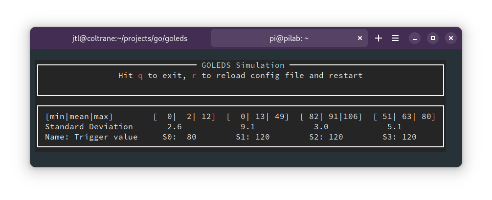

# Go-LEDS

Go-LEDS is a flexible, concurrent lighting system designed to control LED strips using infrared (IR) sensors. It's built for Raspberry Pi but includes a robust terminal-based simulation (TUI) for development and testing on any platform. The system creates responsive, layered light animations triggered by motion, and includes ambient modes like clocks and audio VU meters.

https://github.com/jtl5770/goleds/assets/24967370/34057911-faef-4403-bd07-7b479bec8213

<!--toc:start-->
- [Go-LEDS](#go-leds)
  - [Key Features](#key-features)
  - [How It Works](#how-it-works)
    - [Platform Abstraction](#platform-abstraction)
    - [Producers: The Animation Engine](#producers-the-animation-engine)
  - [Getting Started](#getting-started)
    - [1. Building the Hardware](#1-building-the-hardware)
    - [2. Configuration](#2-configuration)
    - [3. Building the Application](#3-building-the-application)
    - [4. Calibrating Sensors](#4-calibrating-sensors)
  - [Go-LEDS Commander (Management App)](#go-leds-commander-management-app)
  - [Available Producers](#available-producers)
<!--toc:end-->

## Key Features

*   **Sensor-Triggered Animations**: Responsive lighting that reacts to IR motion.
*   **Layered Effects**: Multiple animation "Producers" can run simultaneously, with their outputs combined (max-value blending).
*   **Cross-Platform UI**: Modern management app (Web, Android, Linux) built with Flutter.
*   **Hardware Abstraction**: Runs on Raspberry Pi (SPI/GPIO) or in a terminal simulator (TUI).
*   **Dynamic Reloading**: Configuration changes apply instantly via the Web UI or by file watcher.

## How It Works

### Platform Abstraction

Go-LEDS decouples logic from hardware through a `platform.Platform` interface:

*   **`RaspberryPiPlatform`**: Manages physical SPI communication with LED strips (WS2801, APA102) and ADC converters (MCP3008) for sensors.
*   **`TUIPlatform`**: A terminal-based simulation. It visualizes the LEDs as colored blocks and simulates sensors via keyboard input (keys 1-9).

### Producers: The Animation Engine

Animations are generated by **Producers**. Each producer manages a virtual LED strip. The application combines these outputs, taking the maximum R, G, and B values for each LED. This allows a "Clock" to overlay a "Nightlight," or a "Sensor" pulse to brighten an existing effect.

## Getting Started

### 1. Building the Hardware

The hardware consists of a Raspberry Pi, LED strips, and IR sensors connected via ADCs.
**[➡️ Hardware Build Guide](Hardware.md)**

### 2. Configuration

All settings are in `config.yml`. This defines your LED segments, sensor mapping, and producer behaviors.
**[➡️ See `config.yml.orig` for a full list of documented parameters.](config.yml.orig)**

### 3. Building the Application

This project uses [Task](https://taskfile.dev/) to manage builds.

**To build everything (Local Server, Web UI, Linux App, and Android APK):**
```bash
task
```

**Individual Build Targets:**
```bash
task build-server   # Build the Go server for local development
task build-web      # Build the Flutter Web UI and deploy to ./web
task build-linux    # Build the Flutter Linux Desktop app (bundle)
task build-android  # Build the Flutter Android APK
```

**Running on Raspberry Pi:**
To build for the hardware, run `go build` directly on your Pi. For best performance, run with real-time priority:
```bash
sudo chrt 99 ./goleds -real
```

### 4. Calibrating Sensors

Fine-tuning the `TriggerValue` is essential. Go-LEDS includes a calibration mode that displays live min/max/mean data for your sensors. Run with both `-real` and `-show-sensors` on the Pi:

```bash
sudo ./goleds -real -show-sensors
```



## Go-LEDS Commander (Management App)

The project includes **Go-LEDS Commander**, a modern management interface built with Flutter. 

*   **Web**: Served directly by the Go server at `http://<device-ip>:8080`.
*   **Desktop**: Native Linux application (build via `task build-linux`).
*   **Mobile**: Android APK (build via `task build-android`).

It allows you to toggle producers, adjust colors, and tune timing parameters on the fly with a unified experience across all devices.

## Available Producers

*   **SensorLedProducer**: The core reactive "pulse" animation. Includes a "latch mode" for sustained bright light.
*   **MultiBlobProducer**: Physics-based colored blobs that bounce and collide.
*   **CylonProducer**: A classic moving "eye" effect.
*   **NightlightProducer**: Sunset/sunrise aware ambient glow based on your Lat/Long.
*   **ClockProducer**: A minimalist clock using LED positions for hours and minutes.
*   **AudioLEDProducer**: A real-time stereo VU meter (requires PortAudio).

https://github.com/jtl5770/goleds/assets/24967370/865c70b6-cc20-4b60-899c-8e9182680e21

<!-- Local Variables: -->
<!-- eval: (auto-fill-mode t) -->
<!-- End: -->